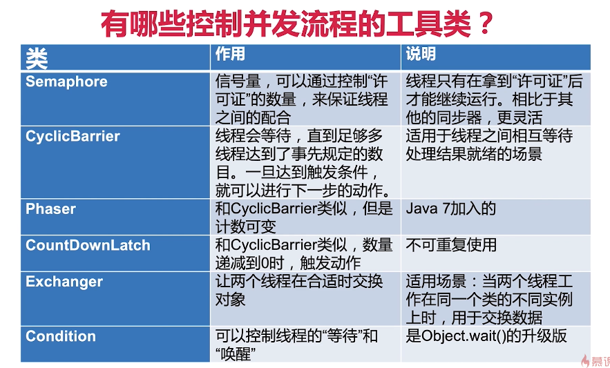

# 1. 并发控制工具类




# 2. CountDownLatch 倒计数门闩

CountDownLatch 称为倒计数门闩，CountDown，倒数；Latch：门闩。主要有以下应用场景：

1. 解析一个 Excel 中多个 sheet 的数据，此时可以考虑使用多线程，每个线程求和一个 sheet 里的数据，等待所有 sheet 都解析完成之后，主线程才能开始执行对所有 sheet 数据求和
2. 模拟双十一压测，创建许1W个线程，等全部创建完毕后
3. 百米赛跑，所有运动员线程准备好后进行等待，当裁判员线程发令枪响，所有运动员线程才可以开始跑步


## 2.1 主要方法

CountDownLatch 三要素：

1. `CountDownLatch(int count)`：构造方法，仅有一个构造函数，参数`count`为需要倒数的值
2. `await()`：调用`await()`方法的线程会被挂起，它会等待`count`为 0 时被唤醒继续执行
3. `countDown()`：将`count`减 1，直至为 0，等待的线程会被唤醒


## 2.2 两种用法

### 2.2.1 一等多

> 需求：工厂中质检环节, 有5个质检员检查, 所有人都认为通过, 才通过

1. 主线程进行等待，等待 5 个质检员线程质检`latch.await()`
2. 质检员线程开始质检，检查完成, 计数器减 1`latch.countDown()`
3. 等待所有质检员质检结束，主线程恢复运行发布质检结果

```java
public class CountDownLatchDemo1 {
    public static void main(String[] args) throws InterruptedException {
        CountDownLatch latch = new CountDownLatch(5);
        ExecutorService executorService = Executors.newFixedThreadPool(5);

        for (int i = 0; i < 5; i++) {
            final int num = i + 1;
            Runnable task = () -> {
                check(latch, num);
            };
            // 提交任务到线程池执行
            executorService.execute(task);
        }
        System.out.println("等待5个质检员检查....");

        // 1.主线程进行等待, 等待5个线程质检结束
        latch.await();

        // 3. 发布质检结果
        System.out.println("5 个质检员检查结束, 产品通过");
        executorService.shutdown();
    }

    // 模拟质检员检查产品
    private static void check(CountDownLatch latch, int num) {
        try {
            // 模拟检查
            TimeUnit.SECONDS.sleep((long) (Math.random()*5));

            System.out.println("No." + num + "完成了检查");
        } catch (InterruptedException e) {
            e.printStackTrace();
        } finally {
            // 2.检查完成, 计数器减1
            latch.countDown();
        }
    }
}
```

```
等待5个质检员检查....
No.5完成了检查
No.3完成了检查
No.1完成了检查
No.4完成了检查
No.2完成了检查
5 个质检员检查结束, 产品通过
```


### 2.2.2 多等一

> 需求：百米赛跑，5 名运动员线程准备好后进行等待，当裁判员线程发令枪响，所有运动员线程才可以开始跑步

1. 5个运动员线程准备好后进行等待`latch.await()`
2. 裁判员线程发令枪响`latch.countDown()`
3. 5个运动员线程开始跑步

```java
public class CountDownLatchDemo2 {
    public static void main(String[] args) throws InterruptedException {
        CountDownLatch latch = new CountDownLatch(1);
        ExecutorService executorService = Executors.newFixedThreadPool(5);
        
        for (int i = 0; i < 5; i++) {
            final int num = i + 1;
            Runnable task = () -> {
                prepare(latch, num);
            };
            // 提交任务到线程池执行
            executorService.execute(task);
        }
        // 模拟裁判员准备工作
        TimeUnit.SECONDS.sleep(4);

        System.out.println("发令枪响, 比赛开始!");
        // 2.裁判员线程发令枪响
        // 倒计数为0, 所有运动员可以起跑了
        latch.countDown();

    }

    private static void prepare(CountDownLatch latch, int num) {
        System.out.println("No." + num + "运动员准备完毕, 等待发令枪");
        try {
            // 1.运动员线程准备好后进行等待
            latch.await();
            // 3.5个运动员线程开始跑步
            System.out.println("No." + num + "运动员已经起跑");
        } catch (InterruptedException e) {
            e.printStackTrace();
        }
    }
}
```

```
No.1运动员准备完毕, 等待发令枪
No.3运动员准备完毕, 等待发令枪
No.2运动员准备完毕, 等待发令枪
No.5运动员准备完毕, 等待发令枪
No.4运动员准备完毕, 等待发令枪
发令枪响, 比赛开始!
No.1运动员已经起跑
No.3运动员已经起跑
No.2运动员已经起跑
No.4运动员已经起跑
No.5运动员已经起跑
```


# 3. Semaphore 信号量

Semaphore 可以用于做**流量控制**，用来限制或管理**数量有限资源**的使用情况。信号量的作用是维护一个**许可证**的计数，线程可以“获取”许可证，那信号量剩余的许可证就减 1，线程也可以“释放”一个许可证，那么信号量拥有的许可证数量就加 1，当信号量锁拥有的许可证数量为 0，那么下一个还想要获取许可证的线程，就需要等待，直至有另外的线程释放了许可证。

应用场景：

例如数据库连接池，最多只能建立 100 个连接，如果太多会导致所有连接不可用。如果有新的线程请求建立数据库连接，如果当前连接数小于100，直接建立连接；如果当前连接数等于 100，那么需要等待，直至有其他线程释放了数据库连接。

**重要方法：**

`acquire()`：获取 1 个许可证

`acquire(int n)`：获取 n 个许可证

`release()`：释放 1 个许可证

`release(int n)`：释放 n 个许可证

`tryAcquire`：尝试获取许可证


> 需求：一个任务，最多同时有 3 个线程执行，即拿到许可证

```java
public class SemaphoreDemo {
    // 公平锁, 许可证数量为3
    public static Semaphore semaphore = new Semaphore(3, true);

    public static void main(String[] args) {
        ExecutorService executorService = Executors.newFixedThreadPool(10);

        for (int i = 0; i < 20; i++) {
            executorService.execute(new Task());
        }
        executorService.shutdown();
    }

    static class Task implements Runnable {
        @Override
        public void run() {
            try {
                // 获取许可证
                semaphore.acquire();
                System.out.println(Thread.currentThread().getName() + "拿到了许可证");

                // 模拟业务操作
                TimeUnit.SECONDS.sleep(2);
            } catch (InterruptedException e) {
                e.printStackTrace();
            }
            System.out.println(Thread.currentThread().getName() + "释放了许可证");
            // 释放许可证
            semaphore.release();
        }
    }
}
```


注意：

1. 获取和释放的许可证数量必须一致，假如每个线程获取2个但只释放1个，随着时间推移，许可证数量为 0，导致新来的线程永远获取不到许可证，最终导致程序卡死
2. 注意在初始化 Semphore 时设置公平性，一般设置为 true 公平更合理。因为 Semaphore 经常使用在资源不足但请求较多的情况，一般都是速度较慢的服务，如果设置为 false 非公平，在高并发环境下，会有线程插队，可能导致排队的线程等待时间极长，不合理
3. 不要求必须由获取许可证的线程来释放许可证，线程 A 获取了，然后线程 B 释放也可以，只要逻辑合理即可


Semaphore 还有一些常见方法，具体如下：

`int availablePermits()`返回此信号量 Semaphore 中可用的许可证数量

`int getQueueLength()` 返回正在等待获取许可证的线程数

`boolean hasQueuedThreads()` 是否有线程正在等待获取许可证

`void reducePermits(int n)` 减少 n 个许可证，是个 protected 方法

`Collection getQueuedThreads()` 获取所有等待获取许可证的线程集合，是个 protected 方法


# 4. Condition 条件

 

Condition 定义了等待 、通知两种类型的方法，Condition 对象是由 Lock 对象创建出来的。

如果说用 Lock 用来代替 synchronized，那么 Condition 就是用来代替 `Object.wait/notify`的，所以用法上几乎一样。


## 4.1 主要方法

`await()`：线程释放锁并挂起等待

`signal()`：唤醒 1 个等待在 Condition 的线程，该线程从等待方法返回前必须获得与 Condition 关联的锁

`signalAll()`：唤醒所有等待在 Condition 的线程，从等待方法返回的线程必须获得与 Condition 关联的锁

```java
public class ConditionDemo {
    private ReentrantLock lock = new ReentrantLock();
    private Condition condition = lock.newCondition();

    public static void main(String[] args) {
        ConditionDemo conditionDemo = new ConditionDemo();
        new Thread(() -> {
            conditionDemo.conditionWait();
        }, "t1").start();

        new Thread(() -> {
            conditionDemo.conditionSignal();
        }, "t2").start();
    }

    public void conditionWait() {
        lock.lock();
        try {
            System.out.println("条件不满足, 开始等待await...");
            condition.await();
            System.out.println("条件满足, 开始执行后续的任务...");
        } catch (InterruptedException e) {
            e.printStackTrace();
        } finally {
            lock.unlock();
        }
    }

    public void conditionSignal() {
        lock.lock();
        try {
            System.out.println("准备工作完成, 唤醒其他线程signal...");
            condition.signal();
        } finally {
            lock.unlock();
        }
    }
}
```


## 4.2 生产者消费者模型

> 使用 Condition 实现生产者 - 消费者模型

1. 定义锁ReentrantLock，根据锁创建两个条件变量 `notFull`和`notEmpty`
   1. 当队列已满，则不可以生产，生产线程进入等待`notFull.await()`
   2. 当消费者消费了 1 个元素，则队列不满可以生产，需要唤醒生产者线程`notFull.signal`
   3. 当队列为空，则不可以消费，消费线程进入等待`notEmpty.await()`
   4. 当生产者生产了 1 个元素，则队列不空可以消费，需要唤醒消费者线程`notEmpty.signal()`

```java
public class ConditionDemo2 {
    private int queueSiez = 10;
    private PriorityQueue<Integer> queue = new PriorityQueue<>(queueSiez);
    private Lock lock = new ReentrantLock();
    // 队列不满, 则可以生产
    private Condition notFull = lock.newCondition();
    // 队列不空, 则可以消费
    private Condition notEmpty = lock.newCondition();
```


2. 生产者
   1. 首先获取独占锁`lock.lock()`
   2. 判断当前队列是否已满，若已满则进入等待并释放锁`notFull.await()`；若未满则生产数据，并唤醒消费者线程`notEmpty.signalAll()`并释放锁`lock.unlock()`，需要注意的是此时消费者和生产者一起抢夺锁，并不一定由消费者获得锁（实际上为了避免上下文切换，大概率是生产者继续获得锁）
   3. 使用`while (queue.size() == queueSiez)`而不使用`if`判断队列已满，是为了避免虚假唤醒。比如有多个生产者线程因为队列满进入

```java
class Producer extends Thread {
    @Override
    public void run() {
        // 不断的生产数据
        while (true) {
            produce();
        }
    }

    private void produce() {
        try {
            lock.lock();
            // 队列满, 生产线程等待
            // 使用while是为了避免虚假唤醒
            while (queue.size() == queueSiez) {
                System.out.println("队列已满, 唤醒消费者消费数据");
                notFull.await();
            }
            // 生产一个元素
            int ele = (int) (Math.random() * 10);
            queue.add(ele);
            System.out.println("生产数据 num: " + ele + ", 队列元素数量: " + queue.size());

            // 队列不空, 唤醒所有生产线程
            notEmpty.signalAll();
        } catch (InterruptedException e) {
            e.printStackTrace();
        } finally {
            lock.unlock();
        }
    }
}
```


3. 消费者
   1. 首先获取独占锁`lock.lock()`
   2. 判断当前队列是否为空，如果为空，则进入等待并释放锁`notEmpty.await()`；如果不为空，则消费 1 个数据，并唤醒所有生产线程`notFull.signalAll()`，并释放锁`lock.unlock()`，需要注意的是此时消费者和生产者一起抢夺锁，并不一定由生产者获得锁（实际上为了避免上下文切换，大概率是消费者继续获得锁）

```java
class Consumer extends Thread {

    @Override
    public void run() {
        // 不断的消费数据
        while (true) {
            consume();
        }
    }

    private void consume() {
        try {
            lock.lock();
            // 队列空, 消费线程等待
            // 使用while是为了避免虚假唤醒
            while (queue.size() == 0) {
                System.out.println("队列为空, 等待生产者生产数据");
                notEmpty.await();
            }
            // 消费一个元素
            Integer ele = queue.poll();
            System.out.println("消费元素 ele: " + ele + ", 队列剩余元素: " + queue.size());

            // 队列不满, 唤醒所有生产线程
            notFull.signalAll();
        } catch (InterruptedException e) {
            e.printStackTrace();
        } finally {
            lock.unlock();
        }
    }
}
```

4. 测试

```java
public static void main(String[] args) {
    ConditionDemo2 demo2 = new ConditionDemo2();
    Producer producer = demo2.new Producer();
    Consumer consumer = demo2.new Consumer();

    producer.start();
    consumer.start();
}
```

```
生产数据 num: 4, 队列元素数量: 1
生产数据 num: 3, 队列元素数量: 2
生产数据 num: 6, 队列元素数量: 3
生产数据 num: 6, 队列元素数量: 4
生产数据 num: 2, 队列元素数量: 5
生产数据 num: 0, 队列元素数量: 6
生产数据 num: 6, 队列元素数量: 7
生产数据 num: 6, 队列元素数量: 8
生产数据 num: 0, 队列元素数量: 9
生产数据 num: 2, 队列元素数量: 10
队列已满, 唤醒消费者消费数据
消费元素 ele: 0, 队列剩余元素: 9
消费元素 ele: 0, 队列剩余元素: 8
消费元素 ele: 2, 队列剩余元素: 7
消费元素 ele: 2, 队列剩余元素: 6
消费元素 ele: 3, 队列剩余元素: 5
消费元素 ele: 4, 队列剩余元素: 4
消费元素 ele: 6, 队列剩余元素: 3
消费元素 ele: 6, 队列剩余元素: 2
消费元素 ele: 6, 队列剩余元素: 1
消费元素 ele: 6, 队列剩余元素: 0
队列为空, 等待生产者生产数据
生产数据 num: 7, 队列元素数量: 1
生产数据 num: 9, 队列元素数量: 2
生产数据 num: 4, 队列元素数量: 3
```


注意：

1. Lock 等价于 synchronized，Condition 等价于共享变量，`lock.lock()`就相当于进入了 synchronized 代码块，`lock.await()/signal()`就等价于共享变量`object.wait()/notify()`，`lock.unlock()`就相当于退出了 synchronized 代码块

2. `lock.await()` 方法会自动释放持有的 Lock 锁，和`object.wait()`一样，不需要自己手动释放锁
3. 调用`lock.await()`的时候，必须持有锁，否则会抛出异常，和`object.wait()`一样

## 4.3 源码分析


# 5. CyclicBarrier 循环屏障

CyclicBarrier 的字面意思是可循环使用（Cyclic）的屏障（Barrier），让一组线程到达一个屏障时被阻塞，直至最后一个线程到达屏障时，屏障才会开门，所有被屏障拦截的线程才会继续运行。与 CountDownLatch 很类似，都能阻塞一组线程。

CyclicBarrier 二要素：

1. 线程数量
2. `await()`阻塞等待


**主要方法：**

1. CyclicBarrier 的默认构造方法是`CyclicBarrier (int parties)`，其参数表示屏障拦截的线程数量，每个线程用`await()`方法告诉`CyclicBarrier `我已经到达了屏障，然后当前线程被阻塞。
2. `CyclicBarrier (int parties, Runnable barrierAction)`，用于在线程到达屏障后，优先执行 barrierAction，方便处理更复杂的业务


`cyclicBarrier.await()`每次调用都会将数量减 1，然后挂起进行等待，当减到 0后所有线程唤醒并继续执行。

```java
public static void main(String[] args) {
    CyclicBarrier cyclicBarrier = new CyclicBarrier(2);

    new Thread(() -> {
        try {
            System.out.println("线程 t1 开始等待");
            cyclicBarrier.await();
            System.out.println("线程 t1 恢复执行");
        } catch (Exception e) {
            e.printStackTrace();
        }
    }).start();
    
    new Thread(() -> {
        try {
            System.out.println("线程 t2 开始等待");
            cyclicBarrier.await();
            System.out.println("线程 t2 恢复执行");
        } catch (Exception e) {
            e.printStackTrace();
        }
    }).start();
}
```

```
线程 t1 开始等待
线程 t2 开始等待
线程 t2 恢复执行
线程 t1 恢复执行
```


## 5.1 屏障

> 需求：旅游车需要等所有游客都到齐之后才能出发，每个游客到达之后会进行等待，直至所有人到齐

1. 游客线程，到达集合地点后开始等待其他人

```java
static class Task implements Runnable {
    private int id;
    private CyclicBarrier cyclicBarrier;

    public Task(int id, CyclicBarrier cyclicBarrier) {
        this.id = id;
        this.cyclicBarrier = cyclicBarrier;
    }

    @Override
    public void run() {
        System.out.println(id + "开始前往集合地点");
        try {
            TimeUnit.SECONDS.sleep((long) (Math.random() * 10));
            
            System.out.println(id + "到达了集合地点， 开始等待其他人");
            cyclicBarrier.await();
        } catch (BrokenBarrierException e) {
            e.printStackTrace();
        } catch (InterruptedException e) {
            e.printStackTrace();
        }
    }
}
```

2. 旅游车线程，所有人到齐后开始出发；启动 5 个线程模拟游客，并给游客传入 cyclicBarrier

```java
public static void main(String[] args) {
    // 这里Runnable是所有线程到达后执行的任务
    CyclicBarrier cyclicBarrier = new CyclicBarrier(5, new Runnable() {
        @Override
        public void run() {
            System.out.println("所有人都到齐了, 大家统一出发...");
        }
    });

    // 启动5个线程
    for (int i = 0; i < 5; i++) {
        new Thread(new Task(i, cyclicBarrier)).start();
    }
}
```

```
0开始前往集合地点
3开始前往集合地点
1开始前往集合地点
2开始前往集合地点
4开始前往集合地点
1到达了集合地点， 开始等待其他人
4到达了集合地点， 开始等待其他人
3到达了集合地点， 开始等待其他人
2到达了集合地点， 开始等待其他人
0到达了集合地点， 开始等待其他人
所有人都到齐了, 大家统一出发...
```


## 5.2 循环

CylicBarrier 是可循环的屏障，当 n 个线程到达屏障后，会打开屏障，让这 n 个线程通行，然后后面来的线程需要再等够 n 个线程都到达，才会打开屏障。

> 需求：旅游车，每到齐5个乘客后就开始发车，即可以循环使用

```java
public static void main(String[] args) {
    // 这里Runnable是屏障打开之后执行的
    CyclicBarrier cyclicBarrier = new CyclicBarrier(5, new Runnable() {
        @Override
        public void run() {
            System.out.println("5人车坐满了, 发车了...");
        }
    });

    // 启动10个线程
    for (int i = 0; i < 10; i++) {
        new Thread(new CyclicBarrierDemo.Task(i, cyclicBarrier)).start();
    }
}
```


## 5.3 CyclicBarrier 与 CountDownLatch 的区别

1. CyclicBarrier 要等固定数量的线程到达了屏障才能继续执行，而 CountDownLatch 只需要等待数字到 0，即 CountDownLatch 用于事件，而 CyclicBarrier 用于线程
2. CountDownLatch 在倒数到 0 并打开门闩后，就不能再次使用了，新来的线程`await()`也会直接通过；而 CyclicBarrier 可以重复使用


## 5.4 CyclicBarrier 计数重置原理

需要注意的是 CyclicBarrier 底层是ReentrantLock，而 CountDownLatch  底层是AQS


# 6. Exchanger 

Exchanger 用于线程间数据的交换，两个线程通过`exchange()`交换数据，如果第一个线程先执行`exchange()`，它会一直等待第二个线程也执行`exchange()`，当两个线程都执行后，两个线程就可以交换数据。

```java
public static void main(String[] args) {
    Exchanger<String> exchanger = new Exchanger<>();

    new Thread(() -> {

        try {
            // 模拟生产数据
            TimeUnit.SECONDS.sleep(2);
            String dataA = "银行流水A";
            System.out.println("生产数据完成:" + dataA + ", 开始交换传输");

            // 等待另一个线程传输交换数据
            String dataB = exchanger.exchange(dataA);
            System.out.println("收到交换数据:" + dataB);
        } catch (InterruptedException e) {
            e.printStackTrace();
        }
    }).start();

    new Thread(() -> {
        try {
            // 模拟生产数据
            TimeUnit.SECONDS.sleep(5);
            String dataB = "银行流水B";
            System.out.println("生产数据完成:" + dataB + ", 开始交换传输");

            // 等待另一个线程传输交换数据
            String dataA = exchanger.exchange(dataB);
            System.out.println("收到交换数据:" + dataA);
        } catch (InterruptedException e) {
            e.printStackTrace();
        }
    }).start();
}
```

```
生产数据完成:银行流水A, 开始交换传输
生产数据完成:银行流水B, 开始交换传输
收到交换数据:银行流水A
收到交换数据:银行流水B
```

