# 1. LockSupport 工具类

`LockSupport`工具类的主要作用是**挂起**和**唤醒**线程，是创建锁和其他同步类的基本线程阻塞原语，即很多锁和同步类的线程阻塞和唤醒都是通过`LockSupport`实现的，是 `wait()`和`notify()`的改良版。


## 1.1 LockSupport 的诞生

> 为什么已经有了 `wait/notify`和`await/signal`，还要搞一个 `LockSupport` ？

Object 的`wait/notify` 的使用有两个限制，代码示例见[Github]()

1. 必须在 synchronized 同步块中调用，否则会报 IllegalMonitorStateException。因为 `wait`方法要释放锁，当然必须先拥有对象锁 monitor
2. `notify`必须在`wait`之后执行，否则`wait`的线程会一直被挂起，无法继续执行


Condition 的`await/signal`的使用也有两个限制，代码示例见[Github]()

1. 必须在 Lock 块中调用，否则会报 IllegalMonitorStateException。因为 `await`方法要释放锁，当然必须先拥有锁
2. `signal`必须在`await`之后执行，否则`await`的线程会一直被挂起，无法继续执行

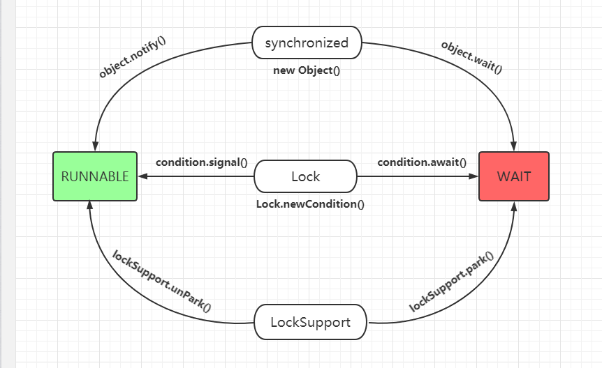

因为 Object 和 Condition 对线程的挂起和唤醒有一些限制，所以引入了更为方便的 LockSupport。


## 1.2 LockSupport 的使用

LockSupport 是一个线程阻塞工具类，所有的方法都是静态方法，可以让线程在任意位置阻塞，可以在任意位置唤醒指定的线程，LockSupport 是使用 Unsafe 类实现的，下面介绍 LockSupport 中的几个重要方法：

1. `static void park()`  挂起线程

2. `static void unPark(Thread thread)` 唤醒指定线程

3. `static void park(long nanos)` 挂起线程，到达指定时间仍未被唤醒，则自动唤醒线程


1. `LockSupport.park()`

下面是 `LockSupport.park()`的使用示例，不需要在同步块中就可以阻塞和唤醒线程，即使唤醒线程的`unpark()`在`park()`之前调用，也能正确唤醒指定的线程。

```java
private static void parkTest() {
    Thread t1 = new Thread(() -> {
        // 休眠2s
        TimeUnit.SECONDS.sleep(2);
        System.out.println("t1 come in");

        // 阻塞线程, 等待唤醒
        LockSupport.park();
        System.out.println("t1 被唤醒");
    }, "t1");

    t1.start();

    new Thread(() -> {
        // 唤醒线程 t1
        LockSupport.unpark(t1);
        System.out.println("t2 通知 t1 唤醒");
    }, "t2").start();
}
```


> LockSupport 将线程比喻为车，每个车都必须有一个`permit` 许可证，阻塞比喻为停车`park`，唤醒线程继续执行比喻为允许通行`unpark`，如果许可证为 1，则允许通过，如果为 0 则需要停车，通行一次会消耗掉 1 次许可证。

LockSupport 使用了一种名为 `permit` （许可证）的概念来实现线程挂起和唤醒的功能，每个线程都有一个 `permit`（许可证），`permit` 只有两个值 `1` 和 `0`，默认为 0。可以将 `Permit`（许可证）看成是一种(0, 1)信号量 Semaphore，但与Semaphore不同的是， `Permit`许可证的累加上限是 1。

我们可以将 `permit`看成为 1, 0 的开关，默认是0。调用一次`unpark`就 +1 变为 1，线程被许可通行继续执行，调用一次`park`就 -1 变为 0，线程立即被唤醒并继续执行。当然，如果再次调用`park`线程就会阻塞，一直等待到`permit`变为 1。需要注意`permit`最高上限为 1，即使多次调用`unpark`，


对于`permit`上限为 1，下面这个例子，先调用了两次唤醒`unpark`，然后调用了两次挂起`park`，经过测试，线程 t1 只能被唤醒 1 次，第一次调用`park`将`permit`置为 0，第二次调用`park`自然无法通过，线程被阻塞挂起。

```java
private static void parkTest2() {
    Thread t1 = new Thread(() -> {
        // 休眠2s
        TimeUnit.SECONDS.sleep(2);
        System.out.println("t1 come in");

        // 阻塞线程, 等待唤醒
        LockSupport.park();
        System.out.println("t1 被唤醒 1 次");
        LockSupport.park();
        System.out.println("t1 被唤醒 2 次");  // 无法被执行到 
    }, "t1");

    t1.start();

    new Thread(() -> {
        // 唤醒线程 t1
        LockSupport.unpark(t1);
        System.out.println("通知唤醒 t1 1 次");

        // 唤醒线程 t2
        LockSupport.unpark(t1);
        System.out.println("通知唤醒 t1 2 次");
    }, "t2").start();
}
```


当调用`park`方法时：

- 如果有`permit`即为 1，则会直接消耗`permit`减 1，然后线程继续执行
- 如果无`permit`即为 0，则会阻塞线程，等待`permit`为 1

当调用`unpark`方法时：

- 如果无`permit`即为 0，则会将`permit`加 1

- 如果有`permit`即为 1，则不会累加，`permit`最高为 1


> 面试题：为什么 LockSupport 可以先唤醒线程后阻塞线程？

因为 unpark 获得了一个许可证，之后再调用 park 方法，就可以直接消费凭证，故不会阻塞线程。

> 面试题：为什么 LockSupport 先唤醒两次，再阻塞两次，但最终该线程还是阻塞状态？

因为许可证的数量最高为 1，连续调用两次unpark唤醒和调用一次效果一样，许可证为 1，而后面调用两次 park 阻塞线程，需要消耗两个许可证才能唤醒，所以线程最终还是阻塞状态。


2. `LockSupport.park(blocker)`

`LockSupport.park(blocker)`是线程被挂起前，将 `blocker` 保存到当前线程内部。我们使用 JConsole 或 jstack 观察线程被阻塞的原因，诊断工具就是通过调用``LockSupport.getBlocker(thread)`来获取 `blocker` 对象的，所以 JDK 推荐使用 `park(blocker)` 方法，并且将`blocker` 设置为 `this`，这样排查线程问题时就能知道是哪个对象导致线程阻塞了。后面的 `ReentrantLock`也是这样将线程挂起的。

```java
public void parkBlockTest() {
    Thread t1 = new Thread(() -> {
        System.out.println("t1 come in");

        // 阻塞线程, 等待唤醒, 设置blocker为this
        LockSupport.park(this);
    }, "t1");

    t1.start();
}
```

上面的方法被调用后线程阻塞了，使用 JConsole 可以看到导致线程阻塞的对象 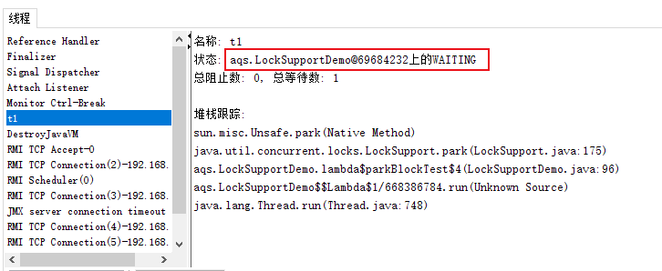

使用`jstack pid`也可以看到导致线程阻塞的对象

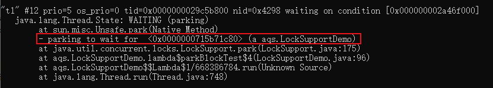


`LockSupport.park(this)` ，当前线程被挂起前，会将 this 作为阻塞者保存到`Thread.parkBlocker`属性当中，这样遇到线程问题时，就可以知道是谁阻塞了当前线程。

```java
LockSupport.java

public static void park(Object blocker) {
    Thread t = Thread.currentThread();
    // 为当前线程t设置blocker
    setBlocker(t, blocker);
    // 挂起线程
    UNSAFE.park(false, 0L);
    // 线程被唤醒后, 清楚线程中的blocker
    setBlocker(t, null);
}

// 使用CAS修改线程t的parkBlocker属性
private static void setBlocker(Thread t, Object arg) {
    UNSAFE.putObject(t, parkBlockerOffset, arg);
}
```


3. `Thread.interrupt`来发送一个中断信号通知线程停止，`Thread.interrupt`并不能真正的中断线程，而是「通知线程应该停止了」，具体到底停止还是继续运行，应该由**被通知的线程自己写代码处理**。


具体来说，当对一个线程，调用 interrupt() 时：

1. 如果线程处于**正常活动状态**，那么会将该线程的中断标志位设置为 true，仅此而已
2. 如果线程处于**被阻塞状态**（例如处于sleep, wait, join 等状态），那么线程将立即退出被阻塞状态，并抛出一个InterruptedException异常。仅此而已。
3. 如果线程被 park 为阻塞状态，那么线程会立即退出阻塞状态
4. 被设置中断标志的线程将继续正常运行，不受影响，具体停止线程的逻辑需要自己写代码处理

下面的代码演示当线程被`Object.wait()`阻塞挂起的时候，收到中断信号会唤醒线程继续执行，并抛出一个InterruptedException异常。

```java
public static void waitInterruptTest() {
    Thread t1 = new Thread(() -> {
        System.out.println("t1 thread begin wait...");

        synchronized (objectLock) {
            try {
                // 阻塞线程
                objectLock.wait();
            } catch (InterruptedException e) {
                e.printStackTrace();
            }
        }

        // 打印中断标志位
        System.out.println(Thread.currentThread().isInterrupted());
        System.out.println("t1 thread continue  ...");
    }, "t1");
    t1.start();

    TimeUnit.SECONDS.sleep(2);

    // 发送中断信号
    t1.interrupt();
}
```

收到中断信号后，会唤醒线程，抛出InterruptedException异常被 catch 并打印，然后线程继续执行，阻塞状态受到中断信号，jvm会复位中断标志位，所以这里打印的是 `fasle`

```cmd
t1 thread begin wait...
java.lang.InterruptedException
	at java.lang.Object.wait(Native Method)
	at java.lang.Object.wait(Object.java:502)
	at aqs.LockSupportDemo.lambda$waitInterruptTest$6(LockSupportDemo.java:147)
	at java.lang.Thread.run(Thread.java:748)
	
false
t1 thread continue  ...
```


下面的代码演示当线程被`LockSupport.park()`阻塞挂起的时候，收到中断信号会唤醒线程继续执行：

```java
public static void parkInterruptTest() {
    Thread t1 = new Thread(() -> {
        System.out.println("t1 thread begin park...");

        // 阻塞线程
        LockSupport.park();

        // 输出中断标志位
        System.out.println(Thread.currentThread().isInterrupted());
        System.out.println("t1 thread continue  ...");
    }, "t1");
    t1.start();

    TimeUnit.SECONDS.sleep(2);

    // 发送中断信号
    t1.interrupt();
}
```

```cmd
t1 thread begin park...
true
t1 thread continue  ...
```


ReentrantLock 在将等待线程入队后，会将线程挂起。当线程被唤醒后，需要判断是被`unpark()`唤醒，还是被中断信号`interrupt`唤醒，所以会将中断信号传递出去`Thread.interrupted()`并清除中断标志位。


## 1.3 LockSupport 源码分析

这一章节并没有搞懂，摘抄了文章[LockSupport.park()实现分析](https://blog.csdn.net/hengyunabc/article/details/28126139)，

1. LockSupport 阻塞线程的`park()`方法底层是`UNSAFE.park()`，唤醒线程的`unpark(thread)`方法底层是`UNSAFE.unpark(thread)`

```java
LockSupport.java

public static void park() {
    UNSAFE.park(false, 0L);
}

public static void unpark(Thread thread) {
    if (thread != null)
        UNSAFE.unpark(thread);
}
```

2. 而 Unsafe 的 `park/unpark`方法都是 `native`方法，需要去

```java
Unsafe.java
    
public native void unpark(Object var1);

public native void park(boolean var1, long var2);
```

3. 每个 java 线程都有一个 Parker 实例，[查看 Parker 类源码](https://github.com/AdoptOpenJDK/openjdk-jdk8u/blob/a1d853a5d797f38f7be8c260f4a83c1b3fe48adc/hotspot/src/share/vm/runtime/park.hpp) 如下所示：

```cpp
class Parker : public os::PlatformParker {
private:
  volatile int _counter ;    // 记录许可证
  ...
public:
  void park(bool isAbsolute, jlong time);
  void unpark();
  ...
}
class PlatformParker : public CHeapObj<mtInternal> {
  protected:
    pthread_mutex_t _mutex [1] ;	//互斥量
    pthread_cond_t  _cond  [1] ;    //条件变量
    ...
}
```

可以看到在Linux系统下，是用的 Posix 线程库 pthread 中的 `mutex`（互斥量），`condition`（条件变量）来实现的，`mutex`和`condition`保护了一个` _counter` 的变量来记录许可证数量 。 `mutex`（互斥量）是操作系统中的概念，参考《现代操作系统》 p75互斥量。


当调用 park 时，先尝试直接能否直接拿到`许可证permit`，即`_counter>0`时，如果成功，则把`_counter`设置为0，并返回：

```cpp
void Parker::park(bool isAbsolute, jlong time) {

    if (Atomic::xchg(0, &_counter) > 0) return;
```

如果不成功，则构造一个ThreadBlockInVM，然后检查_counter是不是>0，如果是，则把_counter设置为0，unlock mutex并返回：

```cpp
    ThreadBlockInVM tbivm(jt);
    if (_counter > 0)  { // no wait needed
        _counter = 0;
        status = pthread_mutex_unlock(_mutex);

        return;
    }
```

否则，再判断等待的时间，然后再调用pthread_cond_wait函数等待，如果等待返回，则把_counter设置为0，unlock mutex并返回：

```cpp
      if (time == 0) {
        status = pthread_cond_wait (_cond, _mutex) ;
      }
      _counter = 0 ;
      status = pthread_mutex_unlock(_mutex) ;
      assert_status(status == 0, status, "invariant") ;
      OrderAccess::fence();
```

当unpark时，则简单多了，直接设置_counter为1，再unlock mutext返回。

简而言之，是用mutex和condition保护了一个_counter的变量，当park时，这个变量置为0，当unpark时，这个变量置为1。


# 2. AQS 队列同步器

AQS （AbstractQueuedSynchronizer）抽象的队列同步器，作者是并发领域的大牛 Doug Lea ，AQS 构建了 ReentrantLock，ReentrantReadWriteLock，CountDownLatch，CyclicBarrier，Semaphore 等常见的锁和同步器，是用来构建锁或其他同步器的基础框架，也是整个 JUC 体系的基石。AQS 通过内置的 FIFO 队列来完成资源获取线程的排队工作，并通过一个 int 类型的变量表示持有锁的状态。


> AQS 到底是什么？

- 面试规则：群面、单面
- 安排面试、排队，就坐、先来后到等 HR 的工作就是 AQS 做的工作
- 面试官来规定面试规则，群面，单面，类似于 CountDownLatch，Semaphore
- 面试官并不关心面试者的顺序，排队，等候就坐的问题，都交给 HR 去做
- Semaphore：当一个人面试完以后，后一个人才能进来继续面试
- CountDownLatch：当 10 个面试者到齐之后，才开始群面
- Semaphore 和 CountDownLatch 要做的是写自己的"要人"规则，比如是“出一个进一个”，“10 人到齐，开始面试”


如果没有 AQS，就需要每个锁或同步工具自己实现：

1. 同步状态的原子性管理
2. 线程的阻塞与唤醒
3. 等待队列的管理
4. 通过 AQS，我们甚至可以自己实现一个并发工具


## 2.1 AQS 的结构

AbstractQueuedSynchronizer 是 `java.util.concurrent.locks`下的抽象类，AQS 也是该包下 ReentrantLock 的底层实现，使用了**模板设计模式**。


AQS 内部有一个 FIFO 队列，用来保存请求资源的线程，`state`是一个 int 类型的变量，表示持有锁的状态，获取锁就是将`state`加 1，释放锁就是将`state`减 1，`state`为 0 则表示没有线程持有该锁。


**AQS 三要素：**

1. state 表示锁的状态
2. FIFO 队列保存等待锁的线程
3. 并发工具类自己去实现**获取锁，释放锁**等重要方法

## 2.2 AQS 的应用


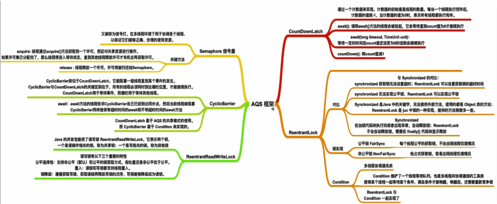


1. `ReentrantLock` 的源码如下所示，内部使用`Sync`来实现加锁和释放锁，公平锁`new ReentrantLock(true).lock()`获取锁的底层是调用 AQS 的 `acquire(1)`方法，`unlock()`释放锁的底层是调用 AQS 的 `release(1)`方法，ReentrantLock 的使用示例见[Github]()

```java
public class ReentrantLock implements Lock, Serializable {

    private final Sync sync;    
    // 创建ReentrantLock时根据参数创建公平锁或非公平锁
    // 不同的锁使用不同的同步器
    public ReentrantLock(boolean fair) {
        sync = fair ? new FairSync() : new NonfairSync();
    }
    	
    // 获取锁是调用的 Sync 子类的lock()方法
	public void lock() {
        sync.lock();
    }
    // 释放锁是调用 AQS 的release()方法
    public void unlock() {
        sync.release(1);
    }

    // Sync 抽象内部类
	// 锁同步控制的基础，子类在公平锁或不公平锁下，都使用AQS的状态state来保存锁的重入次数
    abstract static class Sync extends AbstractQueuedSynchronizer {
        // 抽象方法, 子类FairSync服务公平锁, UnfairSync服务非公平锁
        abstract void lock();
    }

    // 公平锁会调用父类 AQS 的acquire()
    static final class FairSync extends Sync {
        final void lock() {
            acquire(1);
        }
    }
```


`ReentrantLock`公平锁的同步器是`FairSync`，继承自内部类`Sync`，而`Sync`是 AQS 的子类，因为我们说`ReentrantLock`的底层也是 AQS。

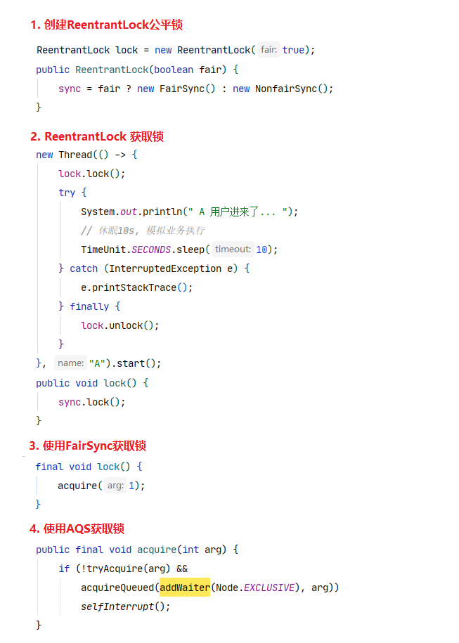

2. `ReentrantReadWriteLock`的源码如下所示，内部使用`Sync`来实现加锁和释放锁，其中读锁`ReadLock.lock()`获取锁的底层是调用 AQS 的 `acquireShared(1)`方法，`unlock()`释放锁的底层是调用 AQS 的 `release(1)`方法，ReentrantReadWriteLock 的使用示例见[Github]()

```java
private final ReentrantReadWriteLock.ReadLock readerLock;
private final ReentrantReadWriteLock.WriteLock writerLock;

// Sync 抽象内部类
abstract static class Sync extends AbstractQueuedSynchronizer {}

// 读锁
public static class ReadLock implements Lock, Serializable {
    private final Sync sync;

    // 创建读锁ReadLock时设置同步器
    protected ReadLock(ReentrantReadWriteLock lock) {
        sync = lock.sync;
    }

    // 获取锁调用 AQS 的acquireShared()方法
    public void lock() {
        sync.acquireShared(1);
    }
    // 释放锁锁调用 AQS releaseShared()方法
    public void unlock() {
        sync.releaseShared(1);
    }
}
```


3. `CountDownLatch`的源码如下所示，内部使用`Sync`来实现，其中`countDown()`的底层是调用 AQS 的 `releaseShared(1)`方法，`await()`释放锁的底层是调用 AQS 的 `acquireSharedInterruptibly(1)`方法，CountDownLatch 的使用示例见[Github]()

```java
private final Sync sync;

public CountDownLatch(int count) {
    // 创建CountDownLatch时设置同步器
    this.sync = new Sync(count);
}

// count-1, 使用AQS的releaseShared()方法
public void countDown() {
    sync.releaseShared(1);
}

// 阻塞等待其他线程执行完毕, 使用AQS的acquireSharedInterruptibly()方法
public void await() throws InterruptedException {
    sync.acquireSharedInterruptibly(1);
}

// Sync 内部类
private static final class Sync extends AbstractQueuedSynchronizer {
    Sync(int count) {
        // 创建Sync时,将 AQS 的state设置为count
        setState(count);
    }
    // 获取AQS中state的值
    int getCount() {
        return getState();
    }
}
```


经过以上 3 个并发类的源码分析，底层都是使用 AQS 来进行锁的获取与释放，而且 `CyclicBarrier`和`Semaphore`底层也是使用 AQS，故我们称 AQS 是构建锁或同步器的基础框架。


**Lock 和 AQS**

- Lock 锁是面向锁的使用者，定义了锁的 api 接口，包括获取锁，释放锁等，程序员写业务代码时使用
- AQS 同步器是面向锁的实现着，规范并简化了锁的实现，屏蔽了同步状态管理，阻塞线程排队，通知唤醒机制等。如果想自己定义一个锁，就可以使用 AQS 来实现


## 2.3 AQS 的实现原理

抢到资源的线程直接处理业务逻辑，抢不到资源的线程必然涉及一种**排队等待机制**，抢占资源失败的线程继续等待，类似于银行业务办理窗口都满了只能去候客区等待，但等待线程仍然保留获取锁的可能，且获取锁的流程仍在继续，类似于候客区的客户也在等待叫号去窗口办理业务。


AQS 中使用 CLH 队列来保存排队线程，暂时获取不到锁的线程都将加入这个队列中，它将请求共享资源的线程被封装为队列的**结点（Node）**，通过 CAS，自旋的方式，维护`state`变量的状态，使用`state`来判断是否阻塞，使用 `LockSupport.park()/unpark(thread)`来阻塞唤醒线程，使得达到同步的控制效果。


1. AQS 使用一个`volatile`的`int`类型变量`state`来表示同步状态，可以通过`getstate` `setState` `compareAndSetState`方法修改。对于`ReentrantLock`，`state`可以表示当前线程获取锁的可重入次数；对于`ReentrantReadWriteLock`，`state`的高 16 位表示读锁的状态，也就是获取该读锁的次数；低 16 位表示获取到血锁的线程的可重入次数；对于`CountDownLatch`，`state`表示计数器当前值；对于`Semaphore`，`state`表示可用信号的个数

```java
AbstractQueuedSynchronizer.java
    
static final class Node {}

// 队列头结点
private transient volatile Node head;

// 队列尾结点
private transient volatile Node tail;

// 同步状态
private volatile int state;

protected final int getState() {
    return state;
}

protected final void setState(int newState) {
    state = newState;
}

protected final boolean compareAndSetState(int expect, int update) {
    return unsafe.compareAndSwapInt(this, stateOffset, expect, update);
}

private final boolean compareAndSetTail(Node expect, Node update) {
    return unsafe.compareAndSwapObject(this, tailOffset, expect, update);
}
```


2. CLH 队列，一个节点 Node 表示一个线程，它保存着线程的引用（thread）、状态（waitStatus）、前驱节点（prev）、后继节点（next），队列中排队线程的状态（waitStatus），线程的状态共有 4 中类型 CANCELLED，SIGNAL，CONDITION，PROPAGATE，Node 源码如下：

```java
static final class Node {
    // 共享 
    static final Node SHARED = new Node();

    // 独占 
    static final Node EXCLUSIVE = null;

    // 当前线程取消等待资源
    // 因为超时或者中断，节点会被设置为取消状态，
    // 被取消的节点时不会参与到竞争中的，他会一直保持取消状态不会转变为其他状态；
    static final int CANCELLED =  1;

    // 后继节点的线程处于阻塞状态等待唤醒，而当前节点的线程如果释放了锁，
    // 将会发送信号唤醒后继节点，使后继节点的线程得以运行
    static final int SIGNAL    = -1;

    // 当前线程在条件队列中,等待被唤醒
    // 该结点中的线程在等待队列中, 因为线程等待condition.await()挂起了线程,
    // 当其他线程condition.signal(),当前线程会被唤醒并转移到同步队列中
    static final int CONDITION = -2;

    // 释放共享资源时会通知其他节点
    static final int PROPAGATE = -3;

    // 状态是上面的 4 种, 初始为0
    volatile int waitStatus;

    // 前驱节点
    volatile Node prev;

    // 后继节点
    volatile Node next;

    // 当前节点保存的线程
    volatile Thread thread;

    // 指向下一个处于CONDITION状态的节点
    Node nextWaiter;

    // 返回前驱节点
    final Node predecessor() throws NullPointerException {
        Node p = prev;
        if (p == null)
            throw new NullPointerException();
        else
            return p;
    }
}
```


Node 的 4 种状态再参考《Java并发编程的艺术 p124》和《Java并发编程之美 p122》


# 3. ReentrantLock 源码分析

三个用户 A B C 来办理业务，但是同时最多只能有一个用户办理业务，我们使用 3 个线程来模拟 3 个用户，使用 ReentrantLock 非公平锁来控制锁的的抢占。

```java
public static void main(String[] args) {
    ReentrantLock lock = new ReentrantLock();

    // ======== 三个用户 A B C 来办理业务, 同时只能有一个用户办理业务 ==========//
    new Thread(() -> {
        lock.lock();
        try {
            System.out.println(" A 用户进来了... ");
            // 休眠10s, 模拟业务执行
            TimeUnit.SECONDS.sleep(10);
        } catch (InterruptedException e) {
            e.printStackTrace();
        } finally {
            lock.unlock();
        }
    }, "A").start();

    // 第2个客户B进来办理业务, 由于第1个客户还持有锁在办理, 此时B只能等待
    new Thread(() -> {
        lock.lock();
        try {
            System.out.println(" B 用户进来了... ");
            // 休眠10s, 模拟业务执行
            TimeUnit.SECONDS.sleep(10);
        } catch (InterruptedException e) {
            e.printStackTrace();
        } finally {
            lock.unlock();
        }
    }, "B").start();

    // 第3个客户C进来办理业务, 由于第1个客户还持有锁在办理, 此时C只能等待
    new Thread(() -> {
        lock.lock();
        try {
            System.out.println(" C 用户进来了... ");
            // 休眠10s, 模拟业务执行
            TimeUnit.SECONDS.sleep(10);
        } catch (InterruptedException e) {
            e.printStackTrace();
        } finally {
            lock.unlock();
        }
    }, "C").start();
}
```


主要分析两个过程：加锁和释放锁

```java
public class ReentrantLock implements Lock, Serializable {

    private final Sync sync;    
	// 这里只研究非公平锁
    public ReentrantLock(boolean fair) {
        sync = fair ? new FairSync() : new NonfairSync();
    }
    	
    // 获取锁是调用的 NonfairSync 的lock()方法, 见方法2
	public void lock() {
        sync.lock();
    }
    // 释放锁是调用 AQS 的release()方法
    public void unlock() {
        sync.release(1);
    }
```

## 3.1 获取锁过程 acquire

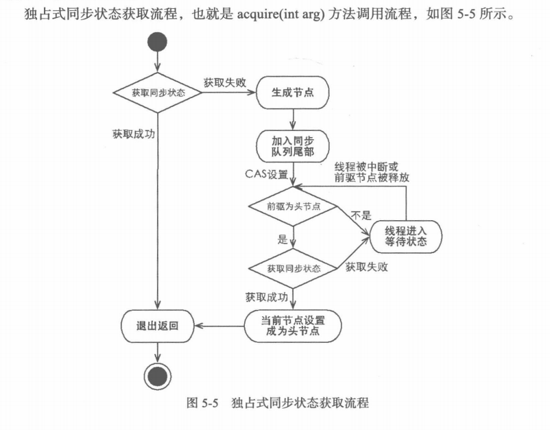

获取锁有 8 个重要方法

- `lock()`
- `acquire()`
- `tryAcquire()`
- `nonfairTryAcquire()`
- `addWaiter()`：将节点node加入等待队列尾部
- `enq(Node node)`：通过死循环来保证节点的正确添加，只有通过 CAS 将节点设置为尾结点后才能从该方法返回
- `acquireQueued()` ：节点以“死循环”的方式获取锁，如果获取不到则阻塞线程，被阻塞的线程主要靠前驱节点的出队来实现
- `shouldParkAfterFailedAcquire(p, node)` 
- `parkAndCheckInterrupt()`


1. 非公平锁获取锁，
   - 如果`state`为 0，则说明当前锁未被占用，则尝试修改`state`为 1；
   - 若修改失败，则使用 AQS 尝试获取锁

```java
ReentrantLock.NonfairSync.java
    
static final class NonfairSync extends Sync {
    // 方法2, 获取锁
    final void lock() {
        // 如果state=0, 则修改为1, 
        if (compareAndSetState(0, 1))
        	// 说明当前锁没有被占用, 直接设置当前线程独占这把锁
            setExclusiveOwnerThread(Thread.currentThread());
        else
            // 当前锁被占用, 尝试获取锁
            // 调用父类 AQS 的acquire(), 见方法3
            acquire(1);
    }

    // 方法4, 非公平的获取锁
    protected final boolean tryAcquire(int acquires) {
        // 调用Sync.nonfairTryAcquire(), 见方法5
        return nonfairTryAcquire(acquires);
    }
}
```

2. 使用 AQS 尝试获取锁，如果获取失败则将当前线程加入等待队列

```java
AbstractQueuedSynchronizer.java

// AQS 的核心方法
// 方法3, 尝试获取锁, 获取失败则将线程封装为node加入等待队列
public final void acquire(int arg) {
    // 尝试获取锁, 见方法4
    if (!tryAcquire(arg) &&
        // 如果获取锁失败, 将线程封装为Node加入等待队列, addWaiter见方法6
        // Node 为独占EXCLUSIVE
        // 将获取锁失败的线程挂起, acquireQueued见方法8
        acquireQueued(addWaiter(Node.EXCLUSIVE), arg))
        
        // 除非当前线程收到了中断信号才会进入到这里, 不用关注
        selfInterrupt();
}
```

3. 尝试获取锁底层会使用非公平锁同步器，这里的`state`表示可重入计数，当为 0 时表示锁不被任何线程占有
   - 如果`state`为 0，则说明当前锁未被占用，直接修改`state`为1获取这把锁
   - 如果`state`不为 0，因为 ReentrantLock 是可重入锁，判断拥有该锁的线程是否为当前线程；如果是则将`state`加1，如果不是则获取锁失败
   - 在上一层`NonfairSync.lock()`已经检查了`stat`不为 0，所以 CAS 失败，使用 AQS 尝试获取锁，如果执行到，恰好那个线程释放了锁，则当前线程不排队直接获取锁，这也是叫非公平锁的原因, 优点是避免了线程的挂起和唤醒

```java
ReentrantLock.Sync.java

// 使用AQS的state来保存锁的重入次数, exclusiveOwnerThread来保存独占这把锁的线程
abstract static class Sync extends AbstractQueuedSynchronizer {
    // 抽象方法, 子类FairSync服务公平 锁, UnfairSync服务非公平错
    abstract void lock();

    // 方法5, 非公平尝试获取锁, 获取失败返回false
    final boolean nonfairTryAcquire(int acquires) {
        final Thread current = Thread.currentThread();
        // 获取AQS队列的state值
        int c = getState();
        
        // 如果state=0, 则说明当前没有人占用锁
        // 在上一层NonfairSync.lock()已经检查了state!=0, 即已经有线程占用了这把锁
        // 如果执行到这,恰好那个线程释放了锁,则当前线程不排队直接获取锁
        // 这也是叫非公平锁的原因, 优点是避免了线程的挂起和唤醒
        if (c == 0) {
             // 如果当前state=0, 则CAS修改为1, 双重检查
            if (compareAndSetState(0, acquires)) {
                
                // 获取锁,即设置锁的拥有者为当前线程,并且是独占Exclusive
                setExclusiveOwnerThread(current);
                return true;
            }
        }
        // ReentrantLock是可重入锁
        // 如果当前线程就是持有锁的线程, 获取锁并将state+1
        else if (current == getExclusiveOwnerThread()) {
            int nextc = c + acquires;
            if (nextc < 0)
                throw new Error("Maximum lock count exceeded");
            
            // 将state加1
            setState(nextc);
            return true;
        }
        
        // 无法获取锁时返回false
        return false;
    }
}
```

4. 第 2 步如果 AQS `tryAcquire`尝试获取锁失败，则将当前线程封装为 node 加入等待队列
   - node 的类型为 EXCLUSIVE，即独占锁，node 保存了当前线程的引用
   - 如果队列尾指针 tail 不为 null，则说明队列不为空，直接将 node入队设置为最后一个节点
   - 如果 node 在 CAS 入队时恰好有其他线程也在入队，导致 CAS 失败，则也使用`enq(node)`自旋将 node 入队
   - 如果队列尾指针 tail 为 null，则说明队列为空，创建队列并入队

```java
AbstractQueuedSynchronizer.java

// 方法6, 线程安全的添加等待线程到等待队列
private Node addWaiter(Node mode) {
    // 创建Node,保存当前线程,独占类型
    Node node = new Node(Thread.currentThread(), mode);
    
    // 尾结点
    Node pred = tail;
    
    // 如果队列不为空
    if (pred != null) {
        // 设置node的前驱节点为队列的尾节点,
        node.prev = pred;
        
        // 如果尾结点等于pred, 则CAS将尾结点tail修改为node
        // 防止有其他线程修改了尾结点
        if (compareAndSetTail(pred, node)) {
            
            // 设置队列原尾结点pred的后继节点为node
            pred.next = node;
            return node;
        }
    }
    // 队列为空或CAS失败则执行入队操作, 见方法7
    enq(node);
    return node;
}
```

5. 将节点 node 入队
   - 如果队列为空，则创建一个傀儡节点`new Node()`作为头节点 head
   - 如果队列不为空，则将节点 node CAS 入队
   - 如果入队时恰好有其他线程也在执行入队操作，导致当前线程node CAS 入队失败，则自旋直至 CAS 成功将当前线程node加入队列

```java
AbstractQueuedSynchronizer.java

// 方法7, 将node线程安全的加入等待队列, 队列为空则先初始化, 然后将node入队
// 入队过程见下图
private Node enq(final Node node) {	// final的作用?
    
    // 在高并发下, 存在CAS失败的可能, 所以需要死循环直至CAS成功将线程加入队列
    for (;;) {
        Node t = tail;
        
        // 如果队列为空, 线程安全的设置一个头结点, 即对队列初始化, 见步骤1
        // 注意并没有将保存线程的node加入等待队列
        if (t == null) {
            // 如果头结点head还为null, 使用CAS将新new一个傀儡node设置为头结点
            // head = new Node()
            if (compareAndSetHead(new Node()))
                
                // 设置尾结点tail为head
                tail = head;
        } 
        // 队列不为空, 线程安全的将保存线程的node加入等待队列
        else {
            // 设置node的前驱节点为队列的尾结点
            node.prev = t;
            
            // 如果尾结点还等于t, 则CAS将队列尾结点tail修改为node, 见步骤2
            if (compareAndSetTail(t, node)) {
                // 将t的后继节点设置为node
                t.next = node;
                return t;
            }
        }
    }
}
```


`enq(node)`入队的操作分为以下 3 个步骤：

1. 初始化等待队列，创建傀儡结点，修改队列的头指针head和尾指针tail

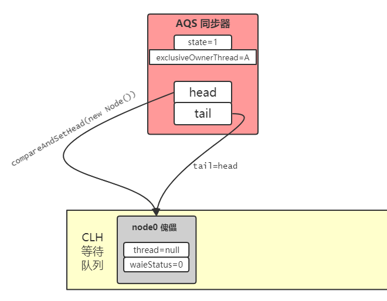

2. 将尝试获取锁失败的线程 ThreadB 加入队列，修改队列的尾指针 tail


3. 将尝试获取锁失败的线程 ThreadC 加入队列，修改队列的尾指针 tail


6. node 入队后，将当前线程挂起
   1. 若node不是队首元素, 则应该挂起当前线程

      若 A 线程正在占有锁，B线程抢占锁失败已经入队，C 线程尝试抢占锁的情况。第 1 次 for 循环中，由于 C 节点的前驱节点是 B 节点，不是 head 傀儡节点，所以当前线程 C 直接被挂起阻塞

      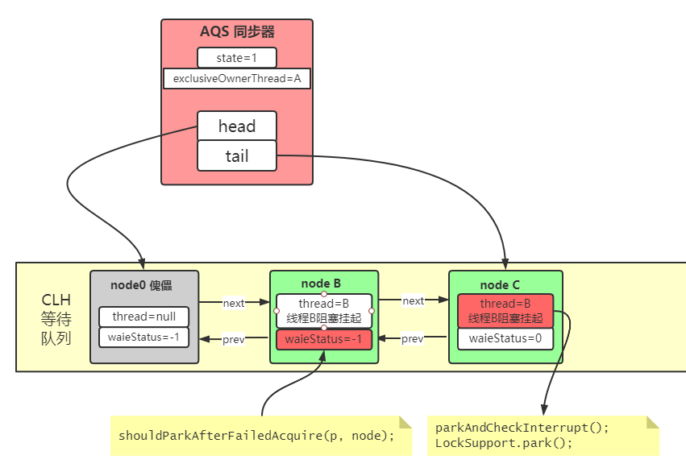

   2. 若node是队首元素，则尝试获取锁，若获取锁成功, 那么说明当前node应该出队

      A 线程刚刚释放了锁，B线程抢占锁成功的情况。在第 1 次 for 循环中，由于 B 节点的前驱节点是 head，所以线程 B 尝试获取锁，因为锁已经被 A 释放，则获取成功，所以将当前节点 B 设置为头节点 head，并清除其保存的当前线程 B，然后 return 退出 for 循环。

      

   3. 若node是队首元素，则尝试获取锁，若获取锁失败, 则应该挂起当前线程

      若 A 线程正在占有锁，B线程尝试抢占锁失败的情况。在第 1 次 for 循环中，由于 B 节点的前驱节点是 head，所以线程 B 尝试获取锁，因为锁被 A 占有，则获取失败，然后将 B 节点的前驱节点状态 waitStatus 修改为 SIGNAL；在第 2 次 for 循环中，尝试获取锁依然失败，由于将 B 节点的前驱节点状态 waitStatus 修改为 SIGNAL，标志线程 B 等待被唤醒，所以当前线程 C 直接被挂起阻塞

      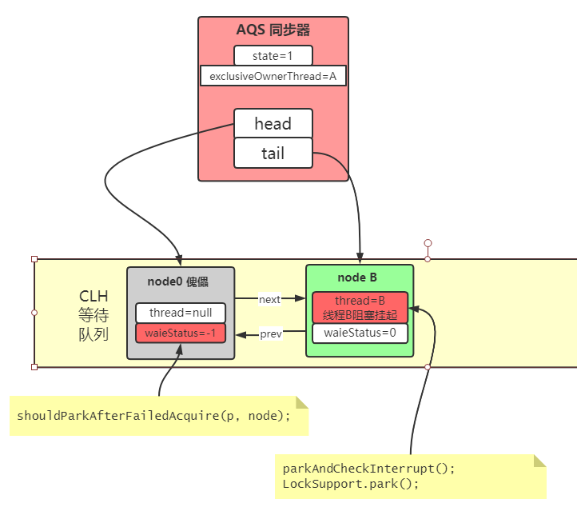

```java
AbstractQueuedSynchronizer.java

// 方法8, 将获取锁失败的线程阻塞挂起
// node是包装了当前线程并进入了等待队列, arg=1
final boolean acquireQueued(final Node node, int arg) {
    boolean failed = true;
    try {
        boolean interrupted = false;
        
        // 自旋获取锁，不会死循环，因为会park阻塞当前线程
        // 当前线程被唤醒后,则会继续尝试获取锁
        for (;;) {
            // 获取node的前置节点, 
            final Node p = node.predecessor();
            
            // 如果node的前置节点为傀儡节点,则尝试获取锁
            // 这里A线程持有锁, B线程获取锁失败, 不会进入if
            // C线程的前置节点不是head, 不会进入if
            if (p == head && tryAcquire(arg)) {
                
                // B节点获取锁成功, 设置B节点为头节点, 清楚其保存的线程B引用
                setHead(node);
                p.next = null; // help GC
                failed = false;
                
                // 获取锁了才能结束自旋
                // 若是被中断的, 返回true
                return interrupted;
            }
            
            // 到这一步说明尝试获取锁失败, 应该park挂起阻塞当前线程, 见方法10
            // 使用LockSupport挂起当前线程, 见方法11
            if (shouldParkAfterFailedAcquire(p, node) &&
                parkAndCheckInterrupt())
                
                // 如果不是被中断的, 不会进入到这里
                interrupted = true;
        }
    } finally {
        // 方法结束或发生异常后执行
        // 1.方法正常结束, 获取到了锁, failed为false
        // 2.发生异常, 如线程收到了中断, 则将该线程从等待队列中移除 
        if (failed)
            cancelAcquire(node);
    }
}

// 方法9, 为队列设置新的傀儡节点head
private void setHead(Node node) {
    head = node;
    // 清楚node中保存的线程
    node.thread = null;
    node.prev = null;
}
```


7. 使用 `LockSupport.park()`将当前线程挂起阻塞
   - B 线程第一次进入，将前驱节点 head 的`waitStatus`修改为SIGNAL=-1，返回false，
   - B 线程第二次进入，返回 true，表示当前线程可以被挂起
   - C 线程第一次进入，将前驱节点 B 的`waitStatus`修改为SIGNAL=-1，返回false
   - C 线程第二次进入，返回 true，表示当前线程可以被挂起
   - 当前线程释放锁后，通过 head 的`waitStatus<0`来判断队列中是否有需要被唤醒的线程

```java
AbstractQueuedSynchronizer.java

// 方法10, 获取失败后应该park, 所以将节点的前驱节点 waitStatus 修改为-1,表示当前节点node应该被挂起阻塞
private static boolean shouldParkAfterFailedAcquire(Node pred, Node node) {
    // 获取傀儡节点的 waitStatus, 默认为0
    int ws = pred.waitStatus;
    
    // 当waitStatus为SIGNAL, 即等待唤醒信号, 则说明当前线程可以阻塞返回true
    if (ws == Node.SIGNAL)	// SIGNAL=-1
        return true;
    
    // ws大于0说明是CANCELLED状态
    if (ws > 0) {
        // 循环找出第一个不是CANCELLED状态的节点
        do {
            node.prev = pred = pred.prev;
        } while (pred.waitStatus > 0);
        pred.next = node;
    } else {
        // 将head的waitStatus修改为SIGNAL,用于后续被唤醒操作
        compareAndSetWaitStatus(pred, ws, Node.SIGNAL);
    }
    // 当前线程还不能被阻塞
    return false;
}

// 方法11, 使用LockSupport挂起当前线程
private final boolean parkAndCheckInterrupt() {
    // 线程挂起, 程序不会继续向下执行
    LockSupport.park(this);
    
    // 根据park方法的描述, 线程在 3 种情况下会继续向下执行
    // 1. 被unpark
    // 2. 被中断 interrupt
    // 3. 其他不和逻辑的返回
    
    // 如果线程被unpark唤醒, 会从这里开始执行, 并返回false 
    // 如果线程被interrupt唤醒, 清除中断标志位, 并返回true
    return Thread.interrupted();
}
```


## 3.2 中断信号的传递

上面获取锁的过程中，有对中断信号的传递，虽然不是重点，但是还是搞清楚更爽，源码分析如下：

```java
public final void acquire(int arg) {
    if (!tryAcquire(arg) &&
        acquireQueued(addWaiter(Node.EXCLUSIVE), arg))
        
        // 线程被interrupt唤醒后, acquireQueued返回true, 见方法1
        // 发送一个中断信号, 业务代码可能对中断信号感兴趣, 见方法2
        selfInterrupt();
}

// 方法1, 线程入队并挂起, 线程恢复并出队
final boolean acquireQueued(final Node node, int arg) {
    boolean interrupted = false;
    for (;;) {
        if (p == head && tryAcquire(arg)) {
            setHead(node);
            p.next = null;
            failed = false;
            
            // 线程被唤醒后会出队, 传递中断标志位
            return interrupted;
        }
        
        // 线程会在这里阻塞
        if (shouldParkAfterFailedAcquire(p, node) &&
            parkAndCheckInterrupt())
            
            // 如果线程被interrupt唤醒, 才会执行这里
            interrupted = true;
    }

}
// 线程会在这里阻塞, 返回中断标志位并复位
// Thread.interrupted()会获取中断标志位, 然后将其复位到false
// 这里复位是因为ReentrantLock并不关心中断信号, 但是需要将中断信号传出, 
// 因为业务代码可能会根据中断信号执行一些操作
private final boolean parkAndCheckInterrupt() {
    LockSupport.park(this);
    
    // 1. 如果线程被unpark唤醒, 返回false
    // 2. 如果线程被interrupt唤醒, 返回true
    // Thread.interrupted()会获取中断标志位, 然后将其复位到false
    return Thread.interrupted();
}

// 发送中断信号
static void selfInterrupt() {
    Thread.currentThread().interrupt();
}

```


## 3.3 释放锁过程 release


1. ReentrantLock 释放锁会直接调用 AQS  的 `release()` 方法

```java
ReentrantLock.java
    
// 释放锁
public void unlock() {
    sync.release(1);
}
```

```java
AbstractQueuedSynchronizer.java

public final boolean release(int arg) {
    // 尝试释放锁, 若释放锁成功, 则唤醒等待队列中的线程, 见方法2.1
    if (tryRelease(arg)) {

        Node h = head;
        
        // 头指针不为null, 且waitStatus!=0, 说明有等待线程
        if (h != null && h.waitStatus != 0)
            // 唤醒线程, 见方法2.2
            unparkSuccessor(h);
        return true;
    }
    return false;
}
```

2. 尝试释放锁`tryRelease()`与尝试获取锁`tryAcquire()`相对应，就是将 AQS 同步器的`state`值减 1

```java
ReentrantLock.Sync.java

// 方法2.1, 释放锁将state减1
protected final boolean tryRelease(int releases) {
    int c = getState() - releases;
    // 如果当前线程未占有这把锁, 则抛出异常
    if (Thread.currentThread() != getExclusiveOwnerThread())
        throw new IllegalMonitorStateException();
    
    boolean free = false;

    // 如果state-1==0, 则说明没有线程占有这把锁
    // 如果是可重入锁, 这里的state等于重入的次数
    if (c == 0) {
        free = true;
        // 设置占有这把锁的线程为 null
        setExclusiveOwnerThread(null);
    }
    
    // 修改AQS的state减1
    setState(c);
    
    // 释放锁成功返回true
    return free;
}
```

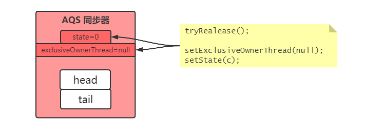

3. 线程 B 挂起等待时会将等待队列 head 节点的 waitStatus 设置为 -1，线程 A 释放锁，会通过`head.waitStatus<0`来判断队列中是否有需要被唤醒的线程，head 的后继节点为 B，则不会进入代码1，直接进入代码2，使用 `LockSupport.unpark(threadB)`唤醒线程 B

```java
// 方法2.2, 唤醒队列中阻塞等待的线程。
private void unparkSuccessor(Node node) {
	// 获取头结点head的waitStatus
    // 若队列中有挂起的线程, 则头节点的waitStatus为SIGNAL=-1
    int ws = node.waitStatus;
    if (ws < 0)
        // 队列中有挂起的线程, 将head的waitStatus设置为0
        compareAndSetWaitStatus(node, ws, 0);

    // 获取head的后继节点, 也是队列中第一个等待唤醒的线程B
    Node s = node.next;
    
    // 代码1, 后继节点为null或状态为CANCEL
    if (s == null || s.waitStatus > 0) {
        s = null;
        // 从尾部开始往前遍历队列, 找到一个处于正常阻塞状态的线程
        // 什么时候会出现这种情况啊 ?
        for (Node t = tail; t != null && t != node; t = t.prev)
            if (t.waitStatus <= 0)
                s = t;
    }
    
    // 代码2
    if (s != null)
        // 唤醒节点s中的线程B
        LockSupport.unpark(s.thread);
}
```

3.  上一步当线程 A 释放了锁之后，会唤醒等待队列中的第一个线程 B。

   - 线程B被唤醒后继续执行新一轮 for 循环，因为节点 B 的前置节点为 head，然后尝试获取锁`tryAcquire(1)`，因为当前锁已经被线程 A 释放，所以获取锁成功。

   - 然后节点 B 进行出队操作，设置节点 B 为头结点 head，清除节点 B 中保存的线程信息。至此，节点 B 出队结束，线程 B 继续执行自己的同步业务代码。

```java
final boolean acquireQueued(final Node node, int arg) {
    boolean failed = true;
    try {
        boolean interrupted = false;
        for (;;) {
            // 获取节点B的前置节点head
            final Node p = node.predecessor();
            // 这里线程B获取锁会成功
            if (p == head && tryAcquire(arg)) {
                // 将节点B设置为头节点, 并清除其保存的线程B引用和前驱节点
                setHead(node);
                // 出队,将原头节点的next置为null, 
                p.next = null; // help GC
                failed = false;
                
                // 获取锁成功后返回, 开始执行线程B的业务方法
                return interrupted;
            }
            
            // 线程B阻塞在此处parkAndCheckInterrupt()，
            // 被唤醒后继续执行for循环
            if (shouldParkAfterFailedAcquire(p, node) &&
                parkAndCheckInterrupt())
                
                // 因为线程B不是被中断唤醒的, 所以不会进入到这里
                interrupted = true;
        }
    } finally {
        if (failed)
            cancelAcquire(node);
    }
}
```


## 3.4 公平锁的抢占原理

当线程 A 释放锁后，打算唤醒等待队列中第一个线程 B，此时恰好进来一个线程 X，此时有两种选择：

1. 非公平锁：线程 X 直接获取锁，避免了线程 X 挂起唤醒浪费资源，线程 B 被唤醒后尝试获取锁失败，然后继续挂起进入阻塞状态
2. 公平锁：线程 X 进入等待队列，线程 B 被唤醒后获得锁，保证了先到先得

> 问题：线程B被唤醒后再次挂起就不是浪费资源吗？

ReentrantLock 非公平锁，当线程 X 尝试获取锁时，会先检查等待队列中是否有等待线程，如果不存在等待线程，则直接获取锁，如果存在等待线程，则获取锁失败，后面会将当前线程 X 入队

```java
ReentrantLock.FairSync
    
protected final boolean tryAcquire(int acquires) {
    final Thread current = Thread.currentThread();
    int c = getState();
    if (c == 0) {
        // (重点) 代码1
        // 1. 判断队列中是否有等待线程
        // 2. 如果有则当前线程不可获取锁, 返回false
        if (!hasQueuedPredecessors() &&
            compareAndSetState(0, acquires)) {
            setExclusiveOwnerThread(current);
            return true;
        }
    }
    // 可重入部分, 与非公平锁一致
    else if (current == getExclusiveOwnerThread()) {
		// ....
    }
    return false;
}
```


摘抄《Java并发编程的艺术 p140》：

**测试场景：**10个线程，每个线程获取 100000 次锁，通过 vmstat 统计测试运行时线程上下文切换次数。

测试结果：公平锁耗时是非公平锁的 94 倍，总切换次数是其 133 倍，可以看出，公平锁保证了锁的获取按照 FIFO 原则，避免了饥饿，但代价是进行了大量的线程切换；非公平锁虽然可能造成线程饥饿，但极少的线程切换，保证了其最大的吞吐量。


# 6. 实战：AQS 实现一次性门闩

**一次性门闩：**默认关闭，所有线程调`await()`用都会进入等待阻塞状态，直至有一个线程调用 `signal()`将门闩打开，那么将唤醒之前阻塞的所有线程，而且这个门闩是一次性的，之后所有调用`await()`的线程会直接继续执行。

一次性门闩我们使用 AQS 负责线程的挂起，入队，唤醒等操作，AQS 的用法如下所示：

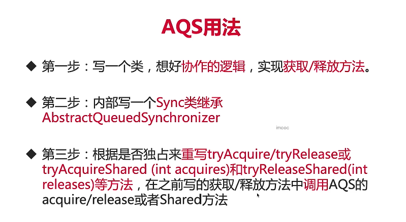


## 6.1 实现 OneShotLatch


根据一次性门闩`OneShotLatch`的特性，明显是多个线程可以获取锁（即继续执行的资格），所以是共享锁，我们实现`tryAcquireShared()`方法，通过判断`state`的值，来判断当前线程是否有通行资格，若门闩关闭，`state=0`，则线程阻塞等待，若门闩打开，`state=1`，则线程继续执行。

```java
public class OneShotLatch {
    private final Sync sync = new Sync();

    // 1.1 获取锁方法
    public void await() {
        // 调用方法1
        sync.acquireShared(0);
    }

    // 1.2 释放锁方法，打开门闩
    public void signal() {
        // 调用方法3
        sync.releaseShared(0);
    }

    // 2 内部写一个Sync继承AQS
    class Sync extends AbstractQueuedSynchronizer {

        // 3.1 根据是否独占来重写tryAcquire()/tryAcquireShared()
        // 方法2, 尝试通过, 根据state的值判断门闩是否打开
        @Override
        protected int tryAcquireShared(int arg) {
            int state = getState();

            // 等于0表示门闩关闭，返回 -1 表示将当前线程加入等待队列
            // 不等于1表示门闩打开,返回 1 表示当前线程可以继续执行
            return state == 0 ? -1 : 1;
        }

        /**
         * 3.1 根据是否独占来重写tryRelease()/tryReleaseShared()
         * 方法4, 打开门闩, 修改state为 1
         */
        @Override
        protected boolean tryReleaseShared(int arg) {
            int state = getState();
            
            // 将 state值修改为 1, CAS是为了防止多个线程同时打开门闩
            if (compareAndSetState(state, 1)) {
                
                // 返回true表示打开门闩放行,所有线程都可以继续执行,
                return true;
            }
            return false;
        }
    }
}
```


一次性门闩 OneShotLatch 的线程等待入队，唤醒线程的操作都由 AQS 实现，源码如下所示：

```java
AbstractQueuedSynchronizer.java

// 方法1, 将等待线程入队并挂起
public final void acquireShared(int arg) {
    // 判断门闩是否打开, 小于0表示未打开, 见方法2
    if (tryAcquireShared(arg) < 0)
        
        // 如果当前线程不可以继续执行, 则将该线程入队
        doAcquireShared(arg);
}

// 方法3, 
public final boolean releaseShared(int arg) {
    // 尝试打开门闩, 见方法4
    if (tryReleaseShared(arg)) {
        
        // 若门闩打开成功, 则唤醒等待队列中的所有线程
        doReleaseShared();
        return true;
    }
    return false;
}
```


## 6.2 使用 OneShotLatch

使用一次性门闩模拟禁行操作，当前道路正在施工，所有司机线程过来都需要等待，当施工完毕，交警线程打开门闩，放行所有司机线程，后面有新的司机线程过来，也不需要等待直接通过。

```java
public static void main(String[] args) throws InterruptedException {
    OneShotLatch latch = new OneShotLatch();
    for (int i = 0; i < 10; i++) {
        final int j = i;
        new Thread(() -> {
            System.out.println("线程" + j + " 尝试获取 latch...");
            latch.await();

            System.out.println("线程" + j + "被唤醒，继续执行业务逻辑....");
        }).start();
    }
    TimeUnit.SECONDS.sleep(5);

    // 打开门闩放行, 唤醒所有等待线程
    System.out.println("======== 打开门闩放行 =======");
    latch.signal();

    // 因为是 一次性门闩, 所以前面打开门闩放行之后, 后面来的线程并不会被阻塞
    new Thread(() -> {
        System.out.println("线程10尝试获取 latch...");
        latch.await();

        System.out.println("线程10被唤醒，继续执行业务逻辑....");
    }).start();
}
```

```
线程0 尝试获取 latch...
线程4 尝试获取 latch...
线程3 尝试获取 latch...
线程2 尝试获取 latch...
线程1 尝试获取 latch...
线程7 尝试获取 latch...
线程8 尝试获取 latch...
线程9 尝试获取 latch...
线程6 尝试获取 latch...
线程5 尝试获取 latch...
======== 打开门闩放行 =======
线程0被唤醒，继续执行业务逻辑....
线程4被唤醒，继续执行业务逻辑....
线程3被唤醒，继续执行业务逻辑....
线程1被唤醒，继续执行业务逻辑....
线程8被唤醒，继续执行业务逻辑....
线程6被唤醒，继续执行业务逻辑....
线程9被唤醒，继续执行业务逻辑....
线程7被唤醒，继续执行业务逻辑....
线程2被唤醒，继续执行业务逻辑....
线程5被唤醒，继续执行业务逻辑....

线程10尝试获取 latch...
线程10被唤醒，继续执行业务逻辑....
```


## 6.3 OneShotLatch 源码分析

通过前面 ReentrantLock 的源码分析，我们知道当线程A释放锁后，会通知唤醒队列中的第一个线程B，并将该节点B置为头结点head，清除其保存的线程B，然后继续执行线程B的业务逻辑

```java
AbstractQueuedSynchronizer.java

final boolean acquireQueued(final Node node, int arg) {
    boolean failed = true;
    boolean interrupted = false;

    for (;;) {
        final Node p = node.predecessor();
        // 线程B被唤醒后, 他的前置节点是head, 并且尝试获取锁成功
        if (p == head && tryAcquire(arg)) {
            // 设置节点B为头节点
            setHead(node);
            p.next = null; 
            failed = false;

            return interrupted;
        }

        // 线程B会在此park阻塞
        // 线程B被唤醒也是从这里开始执行
        if (shouldParkAfterFailedAcquire(p, node) &&
            parkAndCheckInterrupt()) {
            
            // 这里不会执行, 不用关注
            interrupted = true;
        }
	}
}
private void setHead(Node node) {
    head = node;
    node.thread = null;
    node.prev = null;
}
```


> OneShotLatch 当打开门闩`signal()`之后，是如何唤醒所有等待线程的呢？


1. OneShotLatch 释放锁最终会调用 AQS 的`doReleaseShared()`方法，该方法会唤醒等待队列中第一个线程

```java
AbstractQueuedSynchronizer.java

private void doReleaseShared() {

    for (;;) {
        Node h = head;
        if (h != null && h != tail) {
            int ws = h.waitStatus;
            // head有后继节点, 即有等待唤醒的线程
            if (ws == Node.SIGNAL) {
                
                // 将head的waitStatus设置为0, 自旋直至设置成功
                if (!compareAndSetWaitStatus(h, Node.SIGNAL, 0))
                    continue;            // loop to recheck cases
                
                // 唤醒头结点head的后继节点
                // 即唤醒第一个等待线程
                unparkSuccessor(h);
            }
        }
        // 唤醒第一个等待线程成功, 才会执行这里, 退出循环
        if (h == head) 
            break;
    }
}
```

2. 第一个等待线程被唤醒后，会`tryAcquireShared`尝试获取锁，若获取成功，则将当前节点置为头结点head，然后唤醒当前节点的后驱节点，即队列中第二个等待唤醒的线程

```java
AbstractQueuedSynchronizer.java

private void doAcquireShared(int arg) {
    final Node node = addWaiter(Node.SHARED);
    boolean failed = true;

    boolean interrupted = false;
    for (;;) {
        // node队列第一个线程节点
        final Node p = node.predecessor();
        
        // 第一个线程节点的前驱节点必然是head
        if (p == head) {
            
            // 已经打开了门闩, 这里r=1
            // 这个方法由OneShotLatch实现
            int r = tryAcquireShared(arg);
            if (r >= 0) {
                
                // (重点)设置当前节点为head
                // 并唤醒其后置节点, 即第二个等待唤醒的线程
                setHeadAndPropagate(node, r);
                
                p.next = null; // help GC
                if (interrupted)
                    selfInterrupt();
                failed = false;
                return;
            }
        }
        
        // 线程在此park阻塞, 唤醒也是从这里开始执行
        if (shouldParkAfterFailedAcquire(p, node) &&
            parkAndCheckInterrupt()) {
            
            // 这里不会执行, 不用关注
            interrupted = true;
        }
    }
}
```

3. 唤醒第二个等待线程
   1. 首先将当前节点设置为头节点，并清除其保存的线程，此时原队列第二个等待唤醒线程节点 s 已经排到了第一个
   2. 然后执行唤醒操作`doReleaseShared()`，该方法就是步骤一，会唤醒队列中第一个等待线程 s，即原队列第二个等待线程 s
   3. 依次循环，就可以唤醒队列中所有线程

```java
AbstractQueuedSynchronizer.java

// node:队列第一个等待唤醒的线程, propagate:传递唤醒的次数
private void setHeadAndPropagate(Node node, int propagate) {
    Node h = head;
    // 清楚当前节点保存的线程, 并将其设置为head
    setHead(node);	
    
    // 如果propagate > 0则说明唤醒操作需要传递给后面的线程
    if (propagate > 0 || h == null || h.waitStatus < 0 ||
        (h = head) == null || h.waitStatus < 0) {
        
        // s是队列第二个等待唤醒的线程
        Node s = node.next;

        // 必须是请求共享锁的线程
        if (s == null || s.isShared())
            // 唤醒队列第二个等待线程, 见步骤1
            // 这三步依次循环,就可以唤醒所有等待线程
            doReleaseShared();
    }
}
```


经过以上源码分析，我们知道 OneShotLatch 会唤醒队列第一个等待线程，第一个等待线程被唤醒后出队，然后第一个等待线程会去唤醒第二个等待线程，依次循环，就可以唤醒队列中所有的等待线程。


# 补充

## ReentrantReadWriteLock 源码分析

ReadLock 是共享锁，可以多次获取，非公平锁时，读锁仅在等待队列头部不是请求写锁的线程时可以插队；如果等待队列头部是请求读锁，而当目前持有写锁的线程恰好释放写锁是，则新来的读线程会插队获得读锁，这点与非公平锁选择接受新线程而不去唤醒等待线程出策略一致

## Condition 源码分析

有条件队列

// 补充, 参考并发编程艺术p150, 并发编程之美p128

## CyclicBarrier 源码分析

这个底层是 ReentrantLock 不是 AQS

## Semaphore 源码分析

获取锁操作依赖state变量, 获取不到则阻塞当前线程

Semaphore 获取就是acquire方法, 作用是获取一个许可证

CountDownLatch 获取就是 await方法, 作用是等待直至倒数结束


释放锁操作依赖state变量, 唤醒阻塞线程

Semaphore 释放就是release方法, 作用是释放一个许可证

CountDownLatch释放就是countDown方法,作用是倒数一个数


# 并发编程案例

1. Java并发编程的艺术 p106：使用线程池实现数据库连接池和 Web 服务器

2. Java高薪训练营-极客时间：使用多线程实现百万订单的并发处理。使用线程池优化订单处理的设计实现。使用并发容器改进订单的并发处理效率。
3. Java并发编程实战 - 极客时间：高性能网络应用框架Netty，高性能队列Disruptor，高性能数据库连接池 HikariCP


# 参考文档

1. [Java面试题第三季之AQS - 周阳](https://www.bilibili.com/video/BV1Hy4y1B78T?p=16)
2. [Java并发编程的艺术]()  p146
3. [Java并发编程之美 - 第6章]() 
4. [AQS 同步框架 - Doug Lea](http://gee.cs.oswego.edu/dl/papers/aqs.pdf)
5. [AQS 同步框架中文版 - Doug Lea](http://ifeve.com/aqs/)


